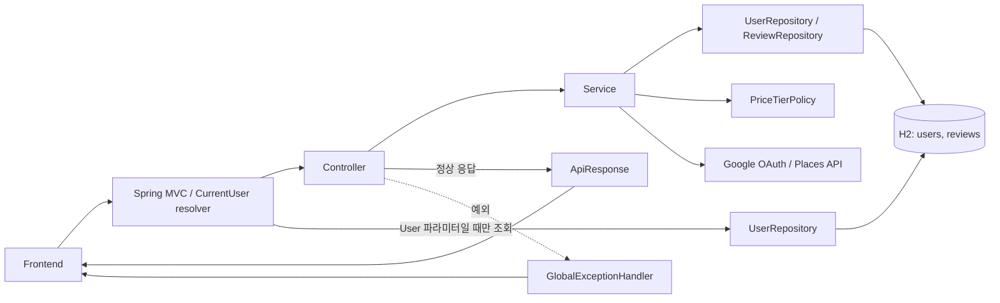
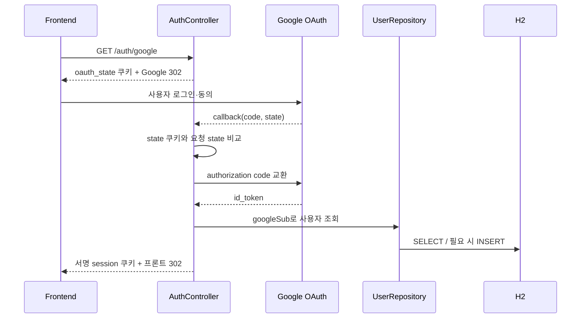
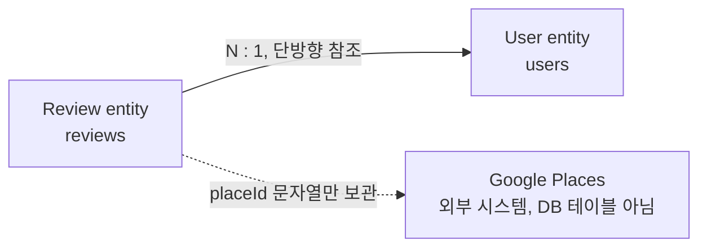

# BudgEats SG 백엔드 코드 흐름과 엔티티 역할

> 기준: 2026-08-18, commit `80cb5d5`
>
> 범위: `backend/src/main`의 현재 Java 구현과 `backend/src/test`의 자동화 테스트
>
> 목적: 초단기 싱가포르 MVP에서 무엇을 H2에 저장하고, 무엇을 요청 시 계산·조회하는지 설명한다.

## 1. 판정 기준

| 표기 | 의미 |
|---|---|
| `CODE_CONFIRMED` | 현재 소스 코드에 실행 경로가 존재한다. |
| `TEST_CONFIRMED` | 자동화 테스트로 해당 동작을 확인했다. |
| `EXTERNAL_UNVERIFIED` | 외부 연동 코드는 있으나 실제 Google 계정·API로는 검증하지 않았다. |
| `GAP` | 코드 또는 기존 SRS와 대조했을 때 빠져 있거나 주의가 필요한 부분이다. |

핵심 결론은 다음과 같다.

- Spring Boot 3.5, Java 21 기반의 단일 백엔드 애플리케이션이다.
- H2에는 `User`와 `Review`만 저장한다.
- 식당 이름·주소·좌표·Google 평점은 저장하지 않고 Google Places에서 요청 시 조회한다.
- 예산 일정은 요청 시 계산할 뿐 저장하지 않는다.
- 세션은 DB 레코드가 아니라 HMAC 서명 쿠키다.
- 자체 리뷰가 충분하면 실제 1인당 평균 가격을 사용하고, 부족하면 Google 가격 수준으로 보완한다.

근거: [build.gradle](../backend/build.gradle), [application.yml](../backend/src/main/resources/application.yml), [User.java](../backend/src/main/java/com/budgeats/sg/domain/User.java), [Review.java](../backend/src/main/java/com/budgeats/sg/domain/Review.java)

## 2. 전체 구조



### 디렉터리별 책임

| 위치 | 책임 |
|---|---|
| `controller/` | HTTP 경로, 입력 검증, 인증 사용자 주입, 응답 상태를 결정한다. |
| `service/auth/` | Google OAuth 코드 교환과 사용자 조회·생성을 담당한다. |
| `service/places/` | Google Places 호출을 한 곳에 격리하고 H2 리뷰 집계와 결합한다. |
| `service/review/` | 리뷰 생성·조회·수정·삭제, 소유권, 태그, 작성 제한을 처리한다. |
| `service/budget/` | 끼니당 예산과 가격 등급을 계산하고 식당을 일정에 배치한다. |
| `domain/` | 실제 JPA 엔티티와 엔티티 저장 형식을 정의한다. |
| `repository/` | 사용자 조회, 리뷰 CRUD와 가격·평점 집계 쿼리를 제공한다. |
| `dto/` | API 요청·응답 형식을 정의한다. 엔티티가 아니다. |
| `core/` | 공통 응답, 오류, CORS, 설정, 가격 정책을 담당한다. |
| `core/session/` | 서명 쿠키 발급·검증과 `@CurrentUser` 주입을 담당한다. |

## 3. 애플리케이션 시작 과정

1. [`BudgeatsApplication`](../backend/src/main/java/com/budgeats/sg/BudgeatsApplication.java)이 Spring Boot 컨텍스트를 시작한다.
2. [`BudgeatsProperties`](../backend/src/main/java/com/budgeats/sg/core/BudgeatsProperties.java)가 OAuth, Places, 세션, 가격 등급, 리뷰 제한 설정을 읽는다.
3. 기본 데이터베이스는 파일형 H2 `jdbc:h2:file:./data/budgeats`이며 Hibernate `ddl-auto: update`가 `users`, `reviews` 스키마를 생성·갱신한다.
4. [`ProductionSecretsValidator`](../backend/src/main/java/com/budgeats/sg/core/ProductionSecretsValidator.java)가 `local` 이외 환경에서 Places 키, OAuth 자격 증명, 세션 비밀값과 Secure 쿠키 설정을 검사한다.
5. [`WebConfig`](../backend/src/main/java/com/budgeats/sg/core/WebConfig.java)가 `/api/**` CORS를, [`SessionWebConfig`](../backend/src/main/java/com/budgeats/sg/core/session/SessionWebConfig.java)가 `@CurrentUser` 인자 해석기를 등록한다.

별도 Flyway 마이그레이션이나 초기 데이터 적재 코드는 없다. 테스트는 파일형 DB 대신 메모리 H2를 사용한다.

## 4. 공통 HTTP 처리 과정

```text
HTTP 요청
  -> Spring MVC가 경로·쿼리·JSON을 바인딩하고 DTO를 검증
  -> 보호 API이면 @CurrentUser가 session 쿠키를 검증
  -> Controller
  -> Service
  -> H2 Repository 또는 Google 외부 API
  -> ApiResponse(success/data 또는 success/error)
```

- 일반 JSON 성공 응답은 [`ApiResponse`](../backend/src/main/java/com/budgeats/sg/core/ApiResponse.java)의 공통 envelope를 사용한다.
- OAuth 시작·콜백은 JSON이 아니라 `302 Redirect`를 사용한다.
- [`GlobalExceptionHandler`](../backend/src/main/java/com/budgeats/sg/core/GlobalExceptionHandler.java)는 대표적으로 400, 401, 403, 404, 409, 422, 429와 500을 공통 오류 형식으로 변환한다.
- `ApiResponse`와 리뷰 응답처럼 `NON_NULL`이 지정된 모델은 null 필드를 생략한다. 반면 예산 후보가 부족하면 `BudgetPlanResponse.MealPlan`의 `"place": null`은 의도대로 포함된다.

## 5. 엔드포인트별 프로세스

| Method | Path | 인증 | H2 | Google | 역할 |
|---|---|---:|---:|---:|---|
| GET | `/api/v1/health` | 불필요 | 없음 | 없음 | 서버 상태 반환 |
| GET | `/api/v1/auth/google` | 불필요 | 없음 | OAuth 이동 | state 쿠키 발급 후 Google로 이동 |
| GET | `/api/v1/auth/google/callback` | 불필요 | User 조회·생성 | OAuth 토큰 교환 | 로그인 완료 및 세션 쿠키 발급 |
| GET | `/api/v1/auth/me` | 필요 | User 조회 | 없음 | 현재 사용자 반환 |
| POST | `/api/v1/auth/logout` | 필요 | 없음 | 없음 | 브라우저 세션 쿠키 제거 |
| GET | `/api/v1/places/nearby` | 불필요 | 리뷰 가격 일괄 집계 | Places | 주변 식당과 가격 등급 반환 |
| GET | `/api/v1/places/search` | 불필요 | 없음 | Places | 식당 최소 정보 검색 |
| GET | `/api/v1/places/{placeId}` | 불필요 | 리뷰 가격·평점 집계 | Places | 식당 상세와 자체 통계 결합 |
| GET | `/api/v1/places/{placeId}/reviews` | 선택 | Review 조회 | 없음 | 최신순 공개 리뷰 반환 |
| POST | `/api/v1/reviews` | 필요 | Review 생성 | 필요 시 가격 보완 | 리뷰 저장 후 가격 등급 재계산 |
| PATCH | `/api/v1/reviews/{reviewId}` | 필요 | Review 수정 | 필요 시 가격 보완 | 작성자 리뷰 수정 후 재계산 |
| DELETE | `/api/v1/reviews/{reviewId}` | 필요 | Review 삭제 | 필요 시 가격 보완 | 작성자 리뷰 삭제 후 재계산 |
| POST | `/api/v1/budget-plans` | 불필요 | 리뷰 가격 일괄 집계 | Places | 저장 없이 예산 일정 계산 |

### 5.1 Google 로그인과 세션



[`SessionManager`](../backend/src/main/java/com/budgeats/sg/core/session/SessionManager.java)는 `userId:만료시각`을 HMAC-SHA256으로 서명한다. 쿠키는 HttpOnly이며 기본 만료는 7일이다. 보호 API에서는 [`CurrentUserArgumentResolver`](../backend/src/main/java/com/budgeats/sg/core/session/CurrentUserArgumentResolver.java)가 서명과 만료를 확인하고, 필요하면 `User`를 조회한다.

세션 테이블은 없다. 따라서 로그아웃은 현재 브라우저의 쿠키만 만료시키며, 이미 탈취된 쿠키를 서버에서 개별 폐기하는 기능은 없다.

### 5.2 주변 식당·검색·상세

주변 식당 흐름은 다음과 같다.

1. [`PlacesClient`](../backend/src/main/java/com/budgeats/sg/service/places/PlacesClient.java)가 Google Places Nearby Search를 호출한다.
2. 식당은 최대 20개를 받고, 필요한 필드만 field mask로 요청한다.
3. [`ReviewRepository.findPriceStatsByPlaceIdIn`](../backend/src/main/java/com/budgeats/sg/repository/ReviewRepository.java)이 모든 `placeId`의 리뷰 수와 평균 가격을 한 번에 집계한다.
4. [`PlaceQueryService`](../backend/src/main/java/com/budgeats/sg/service/places/PlaceQueryService.java)가 Google 데이터와 자체 리뷰 통계를 합친다.
5. [`PriceTierPolicy`](../backend/src/main/java/com/budgeats/sg/core/PriceTierPolicy.java)가 가격 등급을 정한다.
6. 주변 결과는 Google 평점 내림차순으로 반환한다.

검색은 DB를 읽지 않고 `placeId`, 이름, 주소의 최소 정보만 반환한다. 상세는 Google 상세 정보에 자체 리뷰 수, 평균 가격, 평균 평점을 결합한다. Google 식당 정보는 H2에 캐시하지 않는다.

### 5.3 리뷰 생성·조회·수정·삭제

리뷰 생성 흐름은 다음과 같다.

1. 세션에서 내부 사용자 ID를 확인한다.
2. DTO가 `placeId`, 평점, 가격, 본문, 태그 개수, 방문 형태를 검증한다.
3. [`ReviewService`](../backend/src/main/java/com/budgeats/sg/service/review/ReviewService.java)가 본문을 HTML escape하고 태그 allowlist를 확인한다.
4. 사용자 ID가 실제 `User`인지 조회한다.
5. [`ReviewRateLimiter`](../backend/src/main/java/com/budgeats/sg/service/review/ReviewRateLimiter.java)가 사용자별 최근 1시간 작성 횟수를 검사한다.
6. `Review`를 저장한다. 동일 사용자와 동일 식당의 두 번째 리뷰는 unique 제약으로 409가 된다.
7. 저장 후 해당 식당의 리뷰 수·평균 가격·평균 평점을 다시 계산한다.
8. 자체 리뷰 수가 기준보다 적으면 Google 가격 수준을 보완 조회한다. 이 조회가 실패해도 이미 저장된 리뷰의 201 응답은 유지한다.

리뷰 목록은 로그인 없이 볼 수 있다. 로그인 사용자의 리뷰는 `mine=true`로 표시하며, 익명 리뷰는 응답에서 작성자 이름만 숨긴다. DB의 `user_id`는 유지되므로 소유권 검사와 중복 제한은 그대로 작동한다.

수정과 삭제는 리뷰 ID로 조회한 뒤 세션 사용자 ID와 작성자 ID를 서비스에서 비교한다. 다른 사용자는 403, 없는 리뷰는 404다. 삭제는 soft delete가 아니라 실제 행 삭제다.

### 5.4 가격 등급 계산

| 우선순위 | 조건 | 결과 |
|---:|---|---|
| 1 | 자체 리뷰가 기본 3개 이상 | 자체 평균 1인당 가격 사용, source=`actual` |
| 2 | 자체 리뷰 부족 + Google price level 존재 | Google 등급 사용, source=`google` |
| 3 | 둘 다 없음 | tier=`mid`, source=`unknown` |

기본 자체 가격 경계는 `<= 8 SGD` low, `<= 15 SGD` mid, `> 15 SGD` high다. Google level `0~1`, `2`, `3~4`는 각각 low, mid, high로 변환한다.

`source=unknown`일 때 `tier=mid`가 함께 반환되는 것은 “중간 가격임이 확인됨”이 아니라, 데이터가 없을 때 사용하는 기본값이다.

### 5.5 예산 일정

[`BudgetPlanService`](../backend/src/main/java/com/budgeats/sg/service/budget/BudgetPlanService.java)는 상태를 저장하지 않는 계산 서비스다.

```text
끼니당 예산 = 총예산 / (일수 * 하루 끼니 수)
  -> 소수 둘째 자리 반올림
  -> low / mid / high 목표 등급 결정
  -> 주변 식당 중 같은 등급만 후보로 선택
  -> 하루 안에서 같은 식당 중복 없이 배치
  -> 다음 날 시작 위치를 회전
  -> 후보가 부족하면 place=null과 notice 반환
```

`BudgetPlan` 테이블은 없다. 현재 구현은 카테고리 연속 회피(FR-504)와 일정 항목 개별 교체(FR-506)를 제공하지 않는다.

## 6. 영속 엔티티 관계

현재 `@Entity`는 정확히 두 개다.



- `Review.user`에만 lazy `ManyToOne`이 있다. `User`는 리뷰 목록을 갖지 않는다.
- cascade와 orphan removal은 설정하지 않았다.
- `Review.placeId`는 외부 Google 식당 ID 문자열이며 DB 외래 키가 아니다.

### 6.1 `User` 엔티티

역할: Google OAuth 계정을 내부 사용자로 식별하고 리뷰 소유권의 기준이 된다.

| 필드 | DB 제약·수명 | 역할 |
|---|---|---|
| `id` | identity PK | 내부 사용자 식별자 |
| `googleSub` | `NOT NULL`, unique | Google 계정의 고유 subject |
| `displayName` | `NOT NULL` | 화면에 표시할 이름 |
| `createdAt` | `NOT NULL`, 수정 불가 | 최초 저장 시각 |

OAuth 콜백은 `googleSub`로 기존 사용자를 찾고 없을 때만 생성한다. 기존 사용자의 표시명은 재로그인해도 갱신하지 않는다. 사용자 수정·탈퇴 API도 현재 없다.

API의 `/auth/me`는 `id`와 `displayName`만 반환하고 `googleSub`를 직접 노출하지 않는다. 다만 Google `name`이 없으면 이메일을 `displayName` 대체값으로 저장하는 코드가 있으므로, “이메일을 절대 저장하지 않는다”는 보장은 현재 구현과 맞지 않는다.

### 6.2 `Review` 엔티티

역할: Google Places에 없는 자체 평점, 실제 지출 가격, 학생·입맛 태그와 방문 경험을 저장한다.

| 필드 | DB 제약·저장 형태 | 역할 |
|---|---|---|
| `id` | identity PK | 리뷰 식별자 |
| `user` | `user_id`, lazy `ManyToOne`, `NOT NULL` | 작성자와 소유권 |
| `placeId` | `place_id`, `NOT NULL` | 외부 Google 식당 ID |
| `rating` | `NOT NULL` | 자체 평점 |
| `pricePerPerson` | `NOT NULL` | SGD 기준 1인당 실제 가격 |
| `content` | `NOT NULL`, 최대 1,000자 컬럼 | 리뷰 본문 |
| `tasteTags` | JSON 배열 문자열 | 입맛 관련 태그 목록 |
| `studentTags` | JSON 배열 문자열 | 학생 편의 태그 목록 |
| `visitType` | enum 문자열, `NOT NULL` | `SOLO`, `FRIENDS`, `GROUP`, `OTHER` |
| `revisit` | `NOT NULL` | 재방문 의사 |
| `anonymous` | `is_anonymous`, `NOT NULL` | 공개 응답에서 이름 숨김 여부 |
| `createdAt` | `NOT NULL`, 수정 불가 | 생성 시각 |
| `updatedAt` | `NOT NULL` | 최근 수정 시각 |

`(user_id, place_id)` unique 제약으로 한 사용자는 한 식당에 리뷰 한 건만 작성할 수 있다. `user`와 `placeId`는 생성 후 수정 메서드에서 바뀌지 않는다.

평점 `1~5`, 양수 가격, 태그 개수·allowlist는 API DTO와 서비스에서 검사한다. DB `CHECK` 제약은 없으므로 Repository를 직접 사용하면 이 검증을 우회할 수 있다. 리뷰 저장 전에 `placeId`가 실제 Google 식당인지 확인하지도 않는다.

### 6.3 태그 변환기와 enum

- [`StringListJsonConverter`](../backend/src/main/java/com/budgeats/sg/domain/StringListJsonConverter.java)는 `List<String>`을 JSON 배열 문자열로 변환해 H2 컬럼에 저장한다. 별도 태그 테이블이나 JSONB는 사용하지 않는다. 두 컬럼에 길이·물리 타입을 명시하지 않아 실제 타입과 허용 길이는 Hibernate 생성 스키마에 의존한다.
- [`VisitType`](../backend/src/main/java/com/budgeats/sg/domain/VisitType.java)은 리뷰에 문자열로 저장되는 영속 enum이다.
- [`PriceTier`](../backend/src/main/java/com/budgeats/sg/core/PriceTier.java)와 [`PriceTierSource`](../backend/src/main/java/com/budgeats/sg/core/PriceTierSource.java)는 계산·응답용 enum이며 DB에 저장하지 않는다.

## 7. 엔티티가 아닌 주요 모델

| 모델·개념 | 분류 | 수명과 역할 |
|---|---|---|
| `GooglePlace` | 외부 응답 record | Google Places JSON을 Java로 매핑하고 요청 종료 후 폐기 |
| `PlaceSummary`, `PlaceDetail`, `PlaceSearchResult` | 응답 DTO | Google 데이터와 자체 리뷰 통계를 합쳐 프론트에 전달 |
| `PlacePriceStats`, `PlaceReviewSummary` | 조회 projection | JPQL 집계 결과를 전달하며 저장하지 않음 |
| `PriceTierResult` | 값 객체 | 가격 등급·출처·실제 평균을 묶음. 실제 평균은 source=`actual`일 때만 존재 |
| `BudgetPlanRequest`, `BudgetPlanResponse` | API DTO | 요청 시 일정을 계산해 반환하고 저장하지 않음 |
| `session` | 서명 쿠키 | 사용자 ID와 만료 시각을 담으며 서버 세션 레코드 없음 |

특히 `Place`, `BudgetPlan`, `Session`을 JPA 엔티티로 오해하면 안 된다. 세 개 모두 별도 DB 엔티티·테이블로 저장하지 않는다. 다만 `Review`에는 Google `placeId`를 저장하고, 사용자 브라우저에는 서명된 session 쿠키를 저장한다.

## 8. Repository와 집계 책임

### `UserRepository`

- 기본 CRUD
- OAuth 로그인 시 `googleSub`로 사용자 조회
- `@CurrentUser User` 주입 시 세션의 사용자 ID로 실제 사용자 조회
- 리뷰 생성 시 사용자 ID의 유효성 확인

### `ReviewRepository`

- 식당별 리뷰를 최신순으로 조회
- 여러 식당의 리뷰 수·평균 실제 가격을 한 JPQL 쿼리로 집계
- 한 식당의 리뷰 수·평균 실제 가격·평균 평점을 집계
- 기본 CRUD

주변 식당마다 쿼리를 반복하지 않고 `findPriceStatsByPlaceIdIn`으로 한 번에 집계해 N+1 조회를 피한다. 수정·삭제용 소유자 조건 쿼리는 없으며, ID로 리뷰를 읽은 뒤 서비스가 작성자 ID를 비교한다.

## 9. 현재 확인된 한계와 위험

| 중요도 | 상태 | 내용 |
|---:|---|---|
| 높음 | `GAP` | OAuth `id_token`의 payload만 Base64 디코딩하며 서명, issuer, audience, expiry, nonce를 검증하지 않는다. 운영 인증이 완전히 검증됐다고 볼 수 없다. |
| 중간 | `GAP` | OAuth callback은 state를 검증하지만, 쿠키 인증의 POST/PATCH/DELETE에는 별도 CSRF token·Origin 검증이 없다. 기본 SameSite=Lax와 JSON/CORS 조건이 위험을 낮추지만 SameSite 완화 시 재검토가 필요하다. |
| 중간 | `GAP` | `/places/nearby`의 위도·경도·반경에는 범위·양수 검증이 없다. 예산 요청 DTO에는 같은 검증이 있다. |
| 중간 | `GAP` | 메모리 rate limit은 서버 재시작 시 초기화되고 다중 인스턴스 간 공유되지 않는다. 초단기 단일 인스턴스 MVP에만 적합하다. |
| 중간 | `GAP` | 파일형 H2와 `ddl-auto: update`를 사용하며 버전 관리되는 DB migration이 없다. |
| 중간 | `GAP` | 세션 폐기 목록이 없어 탈취된 쿠키를 만료 전 강제 철회할 수 없다. |
| 낮음 | `GAP` | 백엔드는 거리 값을 계산·반환하지 않는다. 프론트에서 FR-303을 충족하는지는 이 문서 범위 밖이다. 카테고리 연속 회피(FR-504)와 일정 항목 개별 교체(FR-506)도 구현하지 않았다. |
| 낮음 | `GAP` | `source=unknown`이어도 `tier=mid`를 반환하므로 프론트가 출처를 함께 표시해야 한다. |

또한 로컬에서 비밀값 없이 애플리케이션이 시작되는 것과 OAuth·Places가 정상 동작하는 것은 별개다. 외부 기능에는 실제 자격 증명이 필요하다.

## 10. 테스트로 확인된 범위

2026-08-18에 `gradlew.bat test --rerun-tasks`를 실행했고 43개 테스트가 모두 통과했다.

| 테스트 | 확인 범위 |
|---|---|
| `ApiContractTest` | health, 공통 오류 envelope, 설정된 origin의 CORS 허용과 credentials |
| `AuthContractTest` | 미인증 401, `/me`, 로그인 redirect와 state 쿠키, 세션 쿠키의 HttpOnly·SameSite=Lax |
| `PlaceContractTest` | 주변·검색·상세 응답, 자체 가격 우선과 Google fallback |
| `ReviewRepositoryTest` | 다중 식당 가격 집계, 단일 식당 요약, 최신순 조회 |
| `ReviewContractTest` | 리뷰 입력·인증·CRUD·소유권·익명·가격 재계산, limiter 단위의 사용자 분리·만료·429 |
| `BudgetPlanTest` | 예산 계산, 경계값, 배치 회전, 후보 부족, 메모리 H2에 `BUDGET_PLANS` 테이블이 없음 |
| `PriceTierPolicyTest` | 실제 가격/Google/unknown 우선순위와 등급 경계 |
| `ProductionSecretsValidatorTest` | local과 non-local 비밀값 정책 |

테스트의 H2는 메모리형이므로 파일형 H2의 재시작 영속성을 검증하지 않는다. Places 관련 테스트는 `PlacesClient`를 mock으로 대체하고 OAuth 테스트도 실제 callback/token 교환을 호출하지 않는다. 따라서 Google OAuth·Places는 `CODE_CONFIRMED`이지만 실환경은 `EXTERNAL_UNVERIFIED`다.

## 11. 추천 코드 읽기 순서

1. [`BudgeatsApplication`](../backend/src/main/java/com/budgeats/sg/BudgeatsApplication.java)과 [`application.yml`](../backend/src/main/resources/application.yml)
2. 네 Controller: [`AuthController`](../backend/src/main/java/com/budgeats/sg/controller/AuthController.java), [`PlaceController`](../backend/src/main/java/com/budgeats/sg/controller/PlaceController.java), [`ReviewController`](../backend/src/main/java/com/budgeats/sg/controller/ReviewController.java), [`BudgetPlanController`](../backend/src/main/java/com/budgeats/sg/controller/BudgetPlanController.java)
3. 두 엔티티: [`User`](../backend/src/main/java/com/budgeats/sg/domain/User.java), [`Review`](../backend/src/main/java/com/budgeats/sg/domain/Review.java)
4. 핵심 서비스: [`PlaceQueryService`](../backend/src/main/java/com/budgeats/sg/service/places/PlaceQueryService.java), [`ReviewService`](../backend/src/main/java/com/budgeats/sg/service/review/ReviewService.java), [`BudgetPlanService`](../backend/src/main/java/com/budgeats/sg/service/budget/BudgetPlanService.java)
5. 공통 정책: [`SessionManager`](../backend/src/main/java/com/budgeats/sg/core/session/SessionManager.java), [`PriceTierPolicy`](../backend/src/main/java/com/budgeats/sg/core/PriceTierPolicy.java), [`GlobalExceptionHandler`](../backend/src/main/java/com/budgeats/sg/core/GlobalExceptionHandler.java)
